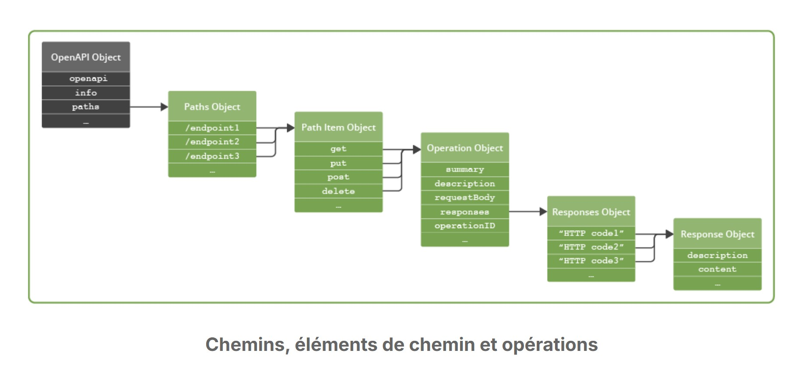
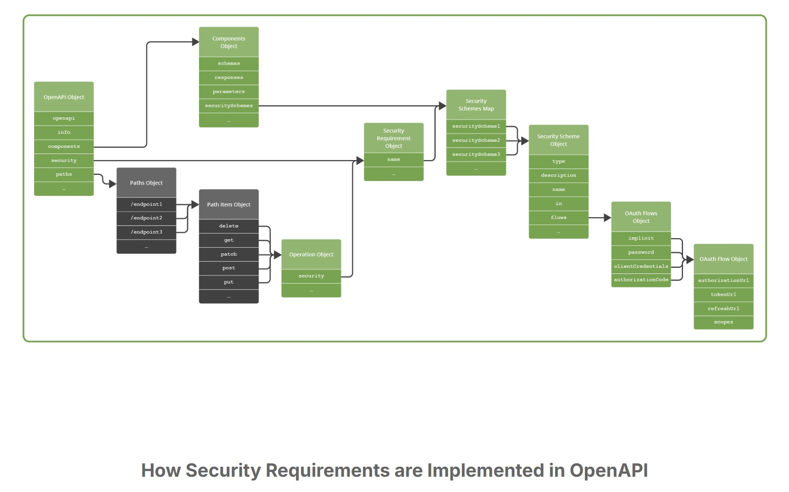

# OpenAPI - Fondamentaux

## Introduction

Source : [LFE1011 - Cours sur les fondamentaux d'OpenAPI](https://trainingportal.linuxfoundation.org/learn/course/openapi-fundamentals-lfel1011/introducing-openapi/introduction?page=1)

Ce cours explique l'origine des APIs et celle d'OpenAPI (notamment Swagger, en 2015)
Il permet de comprendre les spécifications établies dans le **langage de description d'API** fournit par l'OpenAPI Initiative supportée par la Linux Fundation.

Il permet de comprendre comment une API se construit, quels sont les éléments qui doivent être présents et ocmment les articuler.

Le standard OpenAPI est un langage de description d'API permettant d'établir des normes de conception des APIs, d'implémentation des objets, de compatibilité de sécurité et autre. Il est fortement lié au protocole HTTP et au style architecturale REST permettant aux fournisseurs d'API de faire reposer leur produits sur des infrastructures largement déployées, gratuites, et demandant peu d'adaptation de leur part pour permettre l'accès à leurs utilisateurs. Cependant, ce n'est pas le seul protocole permettant l'usage d'API au travers du standard OpenAPI. La forme évoquée précédemment (HTTP+REST) concerne ce qui est appelée communément les APIs Web, il en existe d'autres.

Une autre caractéristiques remarquable est l'utilisation de langage de notation structuré : JSON ou YAML. Il permettent un encodage commun et une interprétation par d'autres outils. Le langage CommonMark (Markdown) permet en outre de fournir des descriptions détaillées et correctement formattée pour chaque composants.

## Les différents objets (les plus importants)

- object Path
- object PathItem
- object Operation (GET, POST, PUT, DELETE, etc.)
- object Responses
- object MediaType (JSON le plus souvent)
- object Item
- object Parameter
- object Components
- object Schema
- object Security
- object securitySchemes
- ...

Au travers de ce cours il est plus facile de se représenter comment il est possible de décrire un composant logiciellement et de permettre une interaction avec celui-ci.

<div align="center">
  
</div>

## Features

Des outils comme [Redoc](https://github.com/Redocly/redoc) permettent de générer des documentation directement à partir d'une descrption ou du code d'une API.

Le versionning suit les recommandations du [Semantic Versionnuing](https://semver.org/) et l'emploi de certains termes normalisés par la [RFC2119](https://datatracker.ietf.org/doc/html/rfc2119)

D'autres normes comme la [RFC7230 - HTML](https://httpwg.org/specs/rfc7230.html#header.fields) permettent de définir des standard notament pour les entêtes HTTP

## Sécurité

La sécurité définie dans OpenAPI n'est pas exhaustive et ne suit que certains [schémas proposés par l'IANA ](https://www.iana.org/assignments/http-authschemes/http-authschemes.xhtml) comme :
- [Basic auth](https://datatracker.ietf.org/doc/html/rfc7617) (id/pwd)
- [Private token ](https://datatracker.ietf.org/doc/html/rfc9577) (apiKey)
- [Mutual TLS](https://datatracker.ietf.org/doc/html/rfc8120)
- [OAuth](https://datatracker.ietf.org/doc/html/rfc5849) (qui doit être implémentée par le fournisseur, OpenApi fourni simplement les bases)

<div align="center">
  
</div>

D'autres langages de description existent comme [RAML](https://raml.org/) ou [API Blueprint](https://apiblueprint.org/).  


## Méthodes d'utilisation

2 approches existent pour construire une API :

- Méthode conceptuelle : On définit le design dans un premier temps, la description avant le codage
- Méthode "code-first" : Où on structure le code d'abord avant de revenir sur le design

La plus répandue est la méthode conceptuelle car elle permet notamment de standardiser une APÏ

Il est possible d'utiliser des outils comme [Swagger Editor](https://editor.swagger.io/) pour rédiger ses APIs avec une assistance syntaxique et un suivi des spécifications en vigueur. Il permet en outre d'observer la représentation que donnerait une documentation à partir du langage de description d'API

## 1ère OpenAPI

Voici un exemple d'API possible avec certaines bonnes pratiques (tags, réutilisation via des schémas de composants et des ref, retour par défaut, etc.) :

```yaml
# object OpenAPI
openapi : 3.1.0
# object Infos
info :
  title: API OpenAPI v3.1 Fondamentaux
  description: Une version simplifiée de l'API Petstore pour le cours OpenAPI v3.1 Fondamentaux.
  version: 1.0.0
tags:
  - name: GET
    description: ________ HTTP GET operations
  - name: Read Pets
    description: Récupérer les propriétés d'un ou plusieurs animaux 

# object Path
paths :
  # object PathItem
  /pets:
    # tags:
    #   - GET
    #   - Read Pets
    # object Operation
    get:
      #object Responses
      responses:
        "200":
          # summary: Liste d'animaux (apparemment invalide)
          description: Listes des animaux proposé par le magasin d'animaux
          content:
            application/json: 
              schema: 
                type: array
                maxItems: 100
                items:
                  $ref: "#/components/schemas/Pet"
        default: 
          description: Réponse HTTP non specifiee
          content:
            application/json:
              schema:
                $ref: "#/components/schemas/Error"
                #
                # (à la place du schéma réutilisable + ref il serait 
                # possible d'inclure directement le code suivant) :
                #
                # Pet:
                #   type: object
                #   required: 
                #     - id
                #     - name
                #   properties: 
                #     id:
                #       type: integer
                #       format: int64
                #     name:
                #       type: string
                #     tag:
                #       type: string

# object Components
components:
  securitySchemes:
    apiKey:
      description: API key as provided in Petstore portal
      type: apiKey
      in: header
      name: api-key

# object Schema
  schemas: 
    Pet:
      type: object
      required: 
        - id
        - name
      properties: 
        id:
          type: integer
          format: int64
        name:
          type: string
        tag:
          type: string
    Error:
      type: object
      required: 
        - code
      properties: 
        code:
          type: integer
          format: int32
        message:
          type: string

# object Security
security:
  - apiKey: []
```